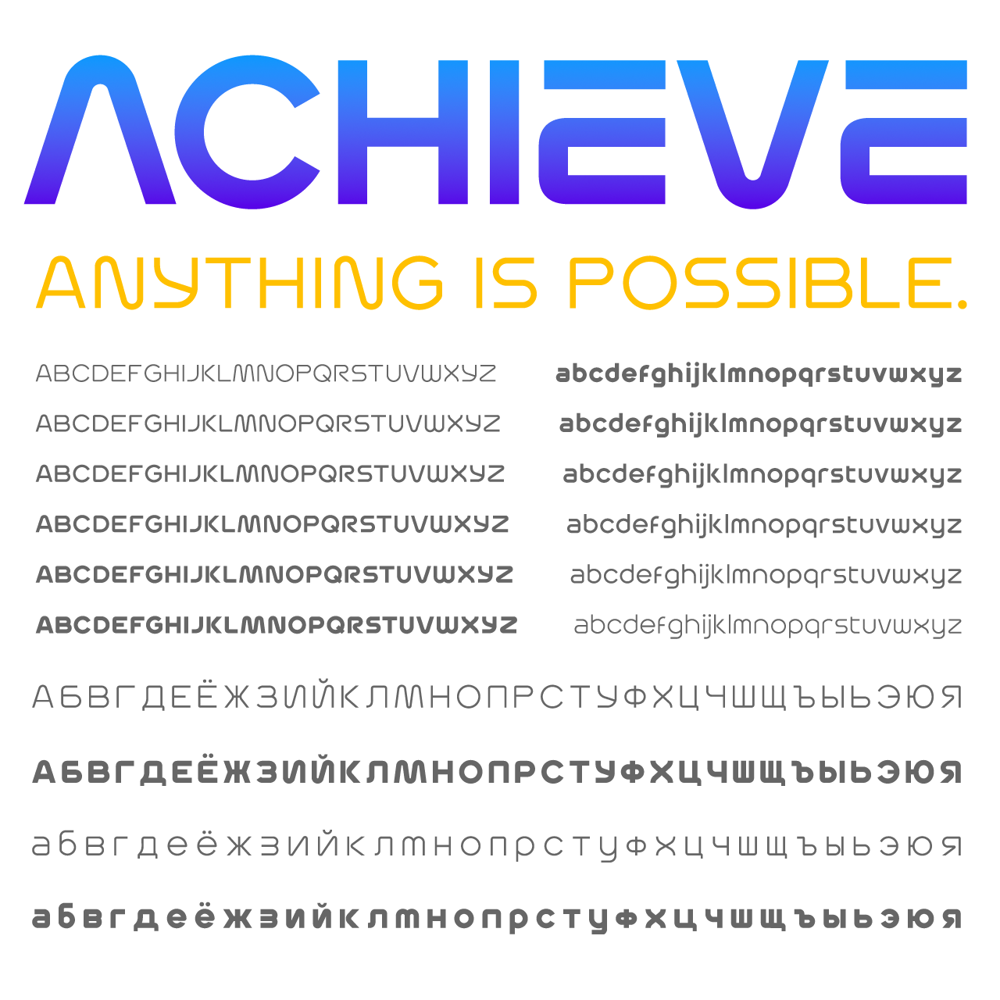

# Achieve

_Achieve_ is a typeface in multiple weights, with support for multiple languages, including Cyrillic script. Inspired by the 70s-era look & feel of a certain [much-beloved space agency](https://standardsmanual.com/products/nasa-graphics-standards-manual), the face expands the famous style into both an upper and lower case, with symbols, figures, and enough ligatures & alternates to adorn a million mission patches.



## License

This Font Software is licensed under the SIL Open Font License, Version 1.1.
This license is copied below, and is also available with a FAQ at
https://scripts.sil.org/OFL


## Building the Fonts

The font is built using fontmake and gftools post processing script. Tools are all python based, so it must be previously installed.

To install all the Python tools into a virtualenv, do the following:

From terminal:

```

cd your/local/project/directory

#once in the project folder create a virtual environment. 
This step has to be done just once, the first time:

python3 -m venv venv

#activate the virtual environment

source venv/bin/activate

#install the required dependencies

pip install -r requirements.txt

```

Then run the this command:

```
cd sources
gftools builder config.yml
```

## License

This Font Software is licensed under the SIL Open Font License, Version 1.1.
This license is available with a FAQ at
https://scripts.sil.org/OFL