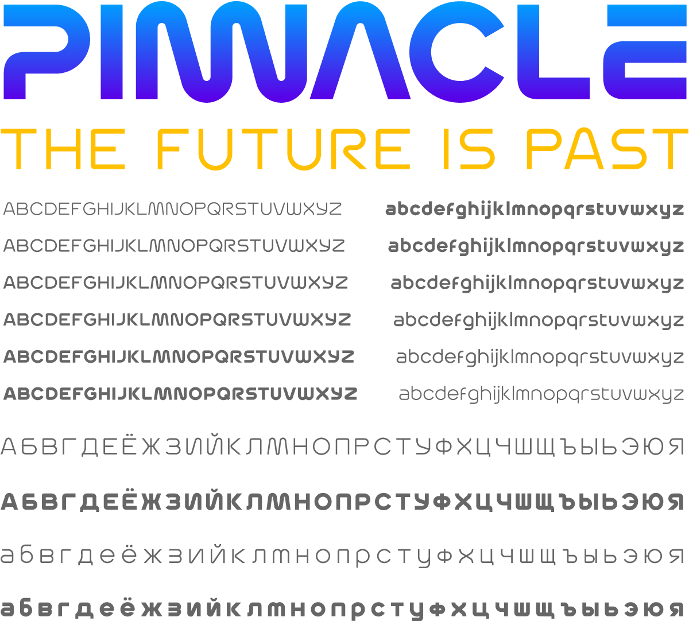

# Pinnacle

_Pinnacle_ is a typeface in multiple weights, with support for multiple languages, including Cyrillic script. Inspired by the 70s-era look & feel of a certain [much-beloved space agency](https://standardsmanual.com/products/nasa-graphics-standards-manual), the face expands the famous style into both an upper and lower case, with symbols, figures, and enough ligatures & alternates to adorn a million mission patches.

